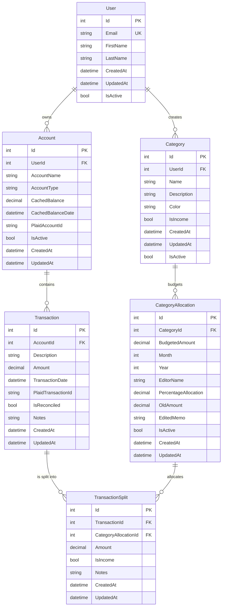

# WNAB Database Entity Relationship Diagram

Here's a diagram

## Entity Descriptions

### Core Entities

**User**
- Primary entity representing a WNAB user
- Contains authentication and profile information

**Category**
- Budget categories (e.g., "Groceries", "Rent", "Salary")

**Account**
- Financial accounts (checking, savings, credit cards)
- Potentially linked to Plaid for automatic transaction import
- Tracks current balance (cached, updated at times)

**Transaction**
- Individual financial transactions
- Can be imported from Plaid or manually entered

**TransactionSplit**
- Links transaction to a budget allocation (CategoryAllocation)
- If the transaction is not split (e.g. the entire transaction amount is for a single category), the system creates a single TransactionSplit behind the scenes for the entire amount
- Every transaction has at least 1 TransactionSplit record
- Enforces budget-first approach: must reference an existing CategoryAllocation
- `IsIncome` flag allows splits to be marked as income separately from expense

### Supporting Entities

**CategoryAllocation**
- Monthly budget allocations per category
- Allows tracking spending vs. budgeted amounts
- Unique constraint: (CategoryId, Year, Month)
- `EditorName`: Tracks who last modified the allocation (for audit trail)
- `PercentageAllocation`: Optional field for percentage-based budgeting
- `OldAmount`: Tracks previous budget amount when changed
- `EditedMemo`: Notes about why allocation was changed
- `IsActive`: Soft delete flag - preserves historical data integrity

## Key Design Features

1. **User Isolation**: All entities are scoped to users for multi-tenant support
2. **Plaid Integration**: Fields for storing Plaid IDs for automatic syncing
3. **Soft Deletes**: IsActive flags instead of hard deletes for Account, Category, and CategoryAllocation
4. **Audit Trail**: CreatedAt/UpdatedAt timestamps on all entities
5. **Budget Tracking**: Monthly budget allocations with comparison to actual spending
6. **Budget-First Approach**: TransactionSplits reference CategoryAllocations (not Categories directly), ensuring budget allocations exist before transactions can be created
7. **Allocation History**: CategoryAllocation tracks changes with EditorName, OldAmount, and EditedMemo fields for audit purposes