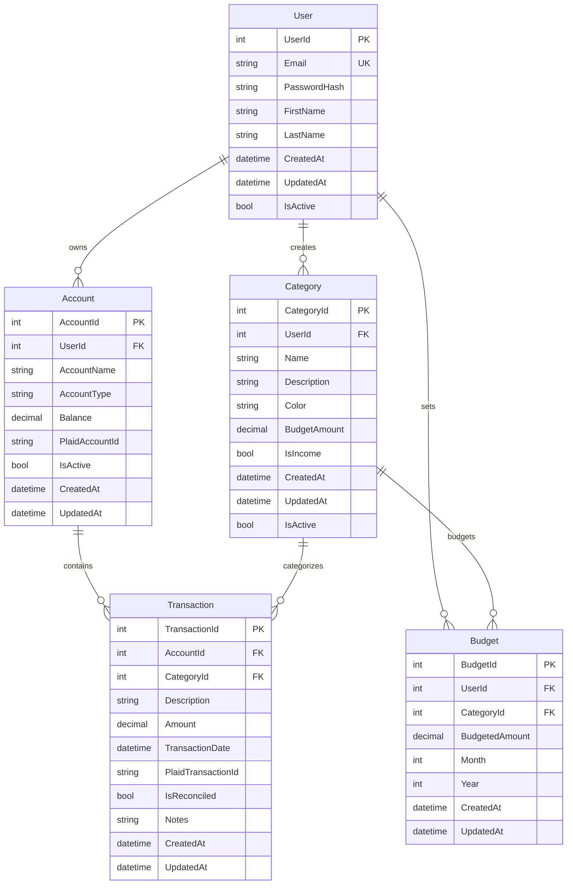

# WNAB Database Entity Relationship Diagram

## Entity Descriptions

### Core Entities

**User**
- Primary entity representing a WNAB user
- Contains authentication and profile information

**Category**
- Budget categories (e.g., "Groceries", "Rent", "Salary")
- Can be income or expense categories
- User-specific with budget amounts

**Account**
- Financial accounts (checking, savings, credit cards)
- Linked to Plaid for automatic transaction import
- Tracks current balance

**Transaction**
- Individual financial transactions
- Links accounts to categories
- Can be imported from Plaid or manually entered

### Supporting Entities

**Budget**
- Monthly budget allocations per category
- Allows tracking spending vs. budgeted amounts

## Key Design Features

1. **User Isolation**: All entities are scoped to users for multi-tenant support
2. **Plaid Integration**: Fields for storing Plaid IDs for automatic syncing
3. **Soft Deletes**: IsActive flags instead of hard deletes
4. **Audit Trail**: CreatedAt/UpdatedAt timestamps on all entities
5. **Simple Design**: Clean MVP structure without complex splitting features
6. **Budget Tracking**: Monthly budget allocations with comparison to actual spending